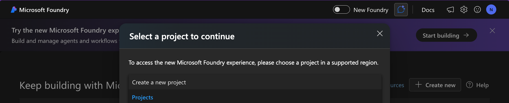
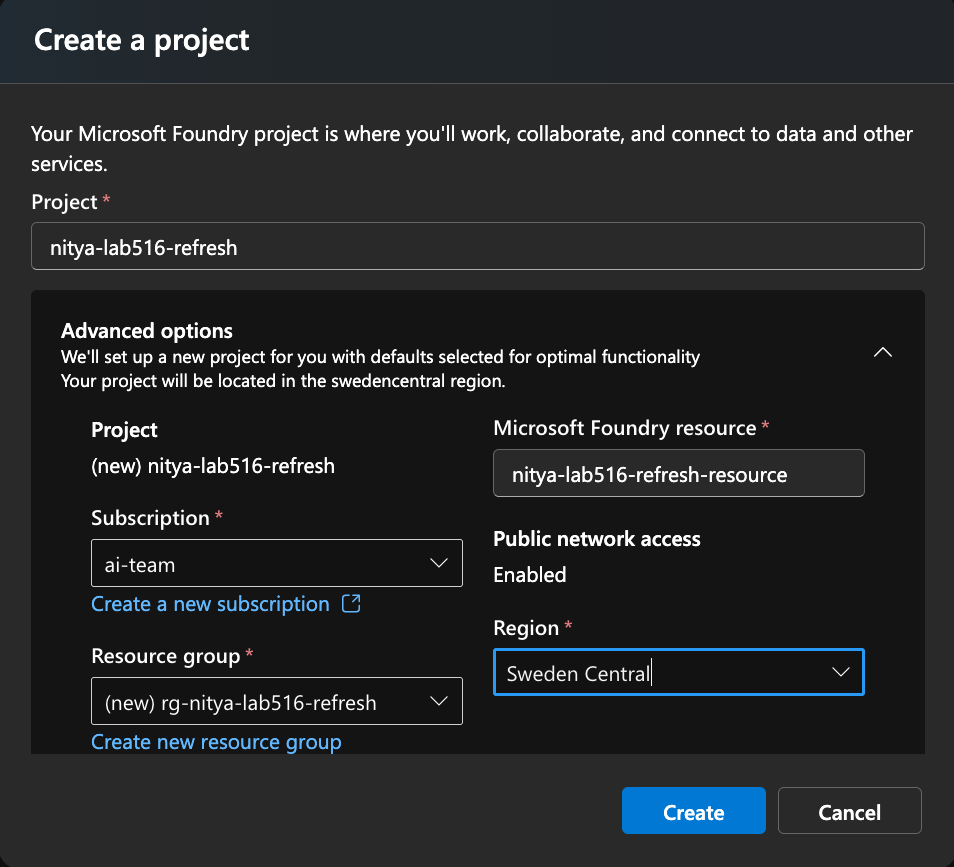
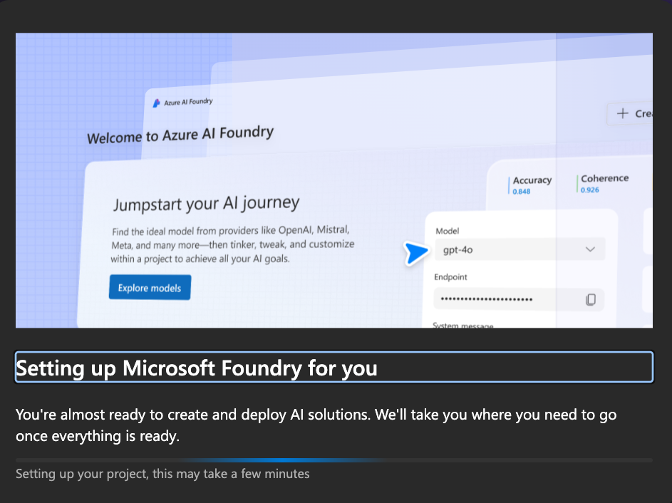
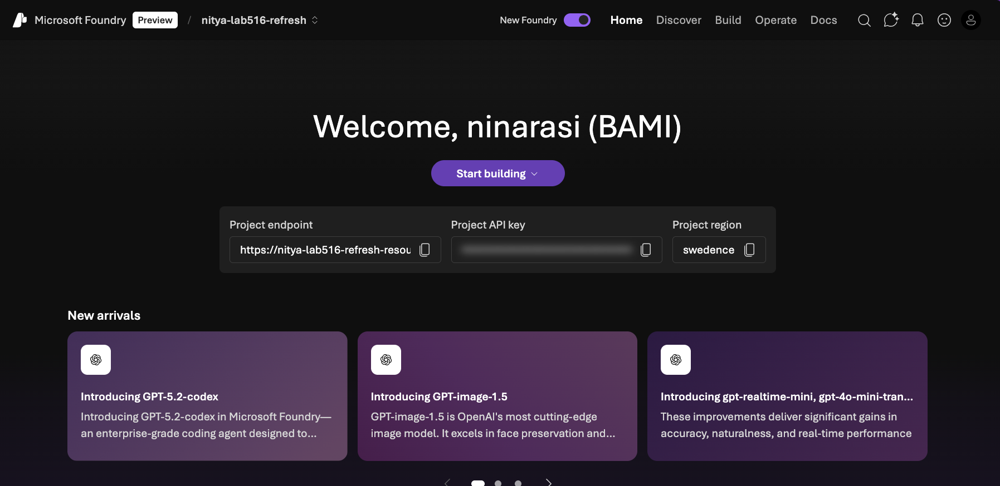
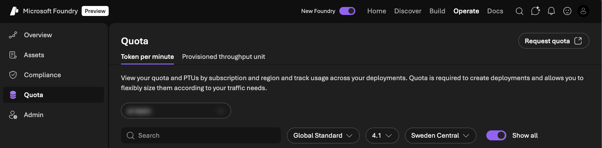
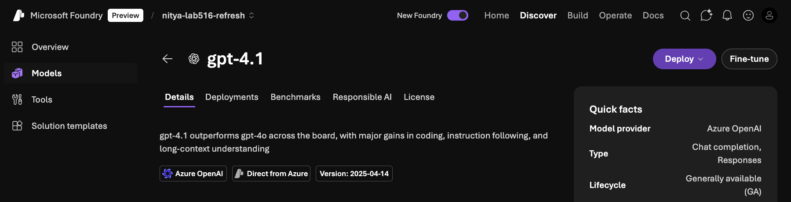
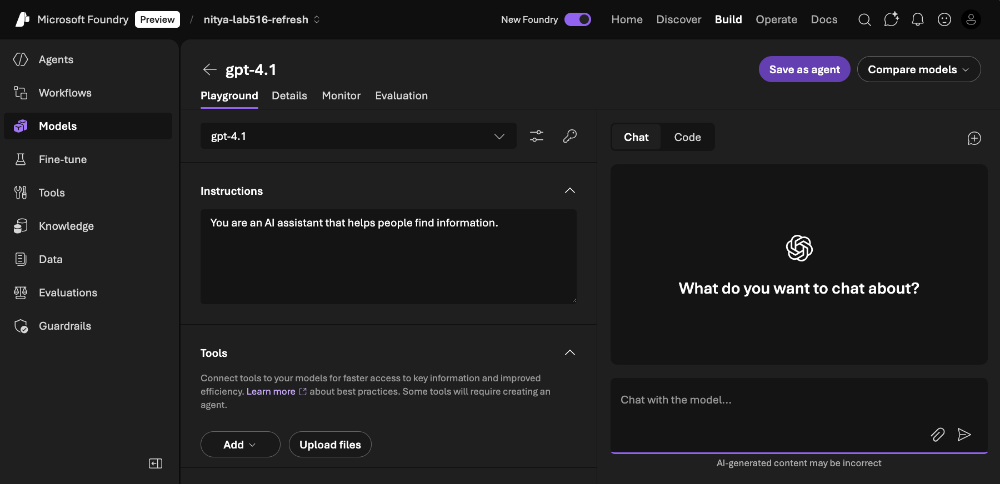
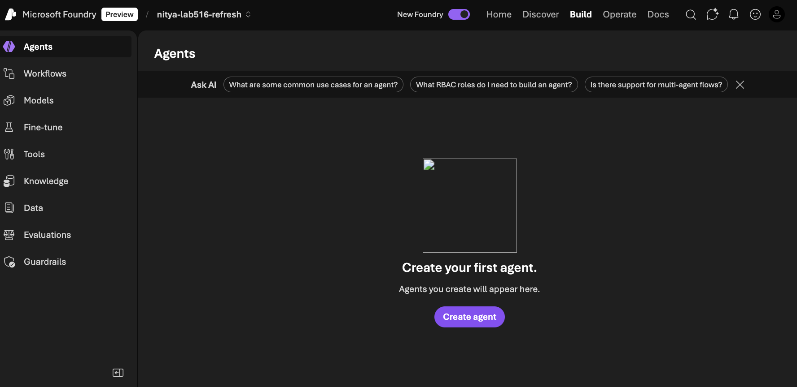
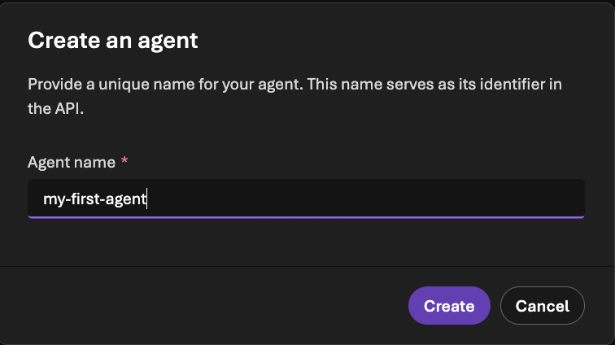
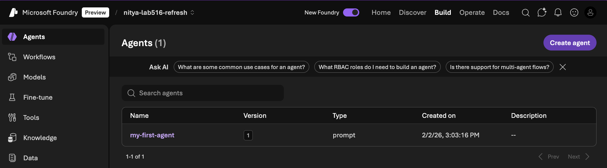

# Safeguard your agents with AI Red Teaming Agent 

> This folder contains a refreshed version of the lab originally delivered at Microsoft Build. It uses the latest Next-Gen UI and Foundry resource, and aligns to the latest samples for Red Teaming.

## Learning Objectives

By completing this lab you should be able to:

1. Describe what an AI Red Teaming agent does (and why)
1. Understand how to use risk categories & attack strategies.
1. Run an AI Red Teaming Scan from the portal (UI) or code-first (SDK)
1. Run an AI Red Teaming Scan for various targets (model, agent, callback)
1. Run an AI Red Teaming Scan locally or in the cloud (to analyze results)

You will also walk away with a sandbox that you can use to continue exploring these concepts on your own.

## 1. Getting Started

### 1.1 Fork the Repo

1. Log into your GitHub account - use a personal profile
1. Click [this link](https://github.com/microsoft/ignite25-LAB516-safeguard-your-agents-with-ai-red-teaming-agent-in-microsoft-foundry/fork) to fork the workshop repo 
1. **Uncheck "main"** - we will need to use a branch!
1. Confirm action - your fork of the repo will open in a new tab.
1. Switch to the [refresh-feb2026](https://github.com/microsoft/ignite25-LAB516-safeguard-your-agents-with-ai-red-teaming-agent-in-microsoft-foundry/tree/refresh-feb2026) branch

**Congratulations!! You have a personal copy of the lab as a sandbox!**

### 1.2 Launch GitHub Codespaces

1. Click the blue "Code" button - select the Codespaces tab - create a new Codespace!
1. You will see a new tab with a VS Code IDE - wait for it to load completely.
1. You will see a VS Code terminal - wait for the prompt to be active.
1. Type `az login` in the terminal - complete the auth flow for Azure.

**Congratulations!! Your development environment is ready**

### 1.3 Create a Foundry Project from Portal

1. Visit the [https://ai.azure.com/](https://ai.azure.com/) portal in the browser.
1. Login with the same Azure credentia above - you will land on the Foundry home page.
1. Look for a _New Foundry_ toggle in the top menu - slide it (turn it purple)
1. You will be prompted to select a project to continue - as shown below

    

1. Select the **Create a new project** option from the drop down instead. You will see a dialog like this:

    

1. **You must pick one of these 4 regions** for red-teaming agents. Confirm creation .. setup will take a few minutes:
    - Sweden Central
    - East US 2
    - France Central
    - Switzerland West

    

1. Complete the workflow - you now have a Foundry Project like this:

    

### 1.4 Deploy a Model

1. Click on the **Operate** tab and look at the **Quota** pane. Pick the region you chose for your project - and see which model you have quota for. (_I used gpt-4.1_)

    

1. Select the model - then click the **Deploy** button and complete action

    

1. The model playground will open - try a test prompt (optional)

    

1. Now select the **Build** menu option and **Agent** sidemenu tab

    

1. Click create an agent - call it `my-first-agent` and confirm

    

1. **Congratulations**; You have a project, a model & an agent!!

    

 

## 2. Setup: Local Environment

### 2.1 Update .env locally
1. Return to GitHub Codespaces tab - open VS Code terminal
1. Type `./2026-REFRESH/infra/setup-env.sh` in the command-line
1. Wait for the script to be run - **you should see a `.env` file in repo**

_This .env file is automatically populated for you - but let's validate it, next_.

### 2.2 Run validation notebook
1. Open the `labs/0-validate-setup.ipynb` notebook in VS Code
1. Click **Select Kernel** and pick the default Python 3.12 option
1. Click **Clear all outputs** and then **Run All**
1. The run completes within seconds

_Scroll to the bottom of the notebook - make sure you have all variables validated!_

**You are now ready to run the other lab notebooks one by one**

## 3. Lab 1: Run Your First Scan

### 3.1 Run it from the portal

### 3.2 Run it from the notebook

## 4. Lab 2: Expand To New Targets

## 5. Lab 3: Run Scan in Cloud

## Related Resources

1. [AI Red Teaming Overview](https://learn.microsoft.com/en-us/azure/ai-foundry/concepts/ai-red-teaming-agent?view=foundry) - Core Documentation
1. [Run AI Red teaming Agent locally](https://learn.microsoft.com/en-us/azure/ai-foundry/how-to/develop/run-scans-ai-red-teaming-agent?view=foundry) - First Tutorial
1. [Run AI Red Teaming Agent in the cloud](https://learn.microsoft.com/en-us/azure/ai-foundry/how-to/develop/run-ai-red-teaming-cloud?view=foundry&source=recommendations&tabs=python) - Preview
1. [azureai-samples](https://github.com/Azure-Samples/azureai-samples/tree/main/scenarios/evaluate/AI_RedTeaming) - try an example workflow
1. [sample_redteam_evaluations.py](https://github.com/Azure/azure-sdk-for-python/blob/main/sdk/ai/azure-ai-projects/samples/evaluations/sample_redteam_evaluations.py) - run redteaming with evals