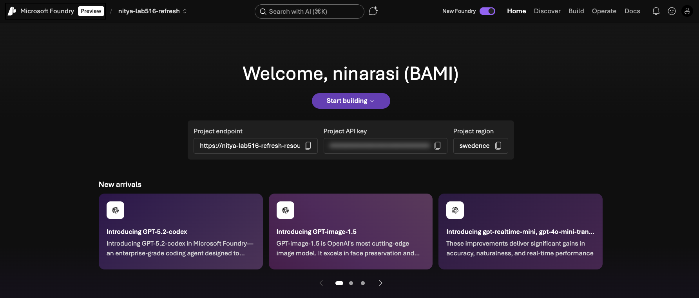

# Setup a Foundry Project

## Pre-Requisites

1. You must have an Azure subscription
1. You must have a personal GitHub account
2. You must be familiar with VS Code, Git and CLI usage

<br/>

## 1. Fork Project & Launch Codespaces

To get started, log into your GitHub profile and fork this project to get your own personal sandbx. 

1. Open the fork in a new browser tab
1. Click the "Code" button and the "Codespaces" tab
1. Click the "Create Codespaces" option to start a new session

This should open a new browser tab with a Visual Studio Code IDE loading up. Wait till this completes and the VS Code terminal become active.

_You now have a prebuilt development environment with all required resoureces pre-installed_.

<br/>

## 2. Verify Installation

We will make use of a few tools in this lab. Let's make sure they are installed correctly.

```bash
# Verify Azure CLI is installed
az version
# ----> Response:
{
  "azure-cli": "2.82.0",
  "azure-cli-core": "2.82.0",
  "azure-cli-telemetry": "1.1.0",
  "extensions": {}
}

# Verify Python 3.12+ is installed
python --version
# ----> Response:
Python 3.12.11

# Verify GitHub CLI is installed
gh --version
# ----> Response:
gh version 2.86.0 (2026-01-21)
https://github.com/cli/cli/releases/tag/v2.86.0
```

<br/>

## 3. Create a Foundry Project via Portal

1. Visit [https://ai.azure.com](https://ai.azure.com) and login with Azure subscription.
1. Click the `New Foundry` toggle - it should trigger a drop down
1. Click the `Create New Project` option - complete the workflow
    - I used `swedencentral` for my region
    - [Other regions supported](https://learn.microsoft.com/en-us/azure/ai-foundry/how-to/develop/run-scans-ai-red-teaming-agent?view=foundry-classic#region-support) are `eastus2`. `francecentral` and `switzerlandwest`
1. You should see something like this. 

    

**Congratulations! Your Foundry Project is Ready!!**

<br/>

## 4. Deploy a Model For Red Teaming

1. Click on the `Build` option in the menu. Select `Models` in sidebar.
1. Click `Deploy a base model`. Search for `GPT-4.1` and deploy it with defaults.
1. Wait till done. Switch back to `Build`/`Models` - you should see model deployed.
1. Leave it with defaults (generic instructions)

**Congratulations! Your Foundry Project has a Deployed Model!!**


<br/>

## 5, Create an Agent for Red Teaming

1. Click on the `Build` option in the menu. Select `Agents` in sidebar.
1. Click `Deploy a base model`. Search for `GPT-4.1` and deploy it with defaults.

## Add Agent Instructions

```bash
You are Cora, Zava Hardware Store's friendly AI assistant. You are polite, helpful, and cheerful.

When responding to customer queries:
1. Start with a short welcoming phrase
2. Answer the question using the product data with one relevant emoji
3. End with a helpful guiding question to continue the conversation

Example: "Great question! 🛠️ Our XYZ Cordless Drill (SKU: PTDR000001) is perfect for home projects at $89.99. We have 45 units in stock. Would you like to know about warranties or accessories?"

Always ground your responses in the actual product catalog data. Be accurate about SKUs, prices, stock levels, and product descriptions
```

Upload a few files including `PLTFL001.md` - keep it to 5 files or so to work within quota constraints and have fast turnaround.


Ask:

```bash
What is a good tape for sealing water leaks?
```


